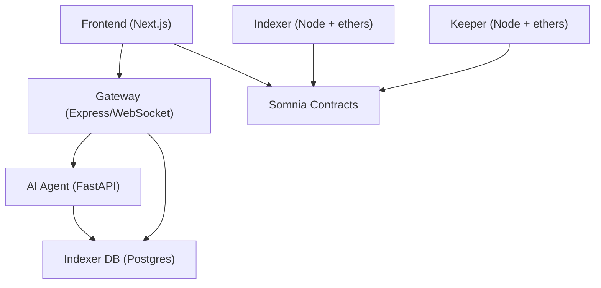

# BitDrum Somnia Migration Implementation Plan

## Overview
This plan turns the current Starknet-oriented BitDrum repository into a Somnia EVM implementation aligned with the provided protocol specification. The work is structured so we can ship a usable foundation quickly: establish Solidity contracts first, then migrate the backend services and frontend onto shared Somnia EVM assumptions.

## Goals
- Replace the placeholder contract workspace with a working Somnia-ready Solidity protocol baseline.
- Migrate the backend service contracts, RPC assumptions, and data flow from Starknet to Ethers.js-compatible EVM services.
- Migrate the frontend from Starknet/Cartridge-specific flows to Somnia EVM-oriented data models and protocol vocabulary.
- Keep changes incremental, testable, and committed in major slices.

## Non-Goals
- Production deployment to Somnia mainnet during this implementation pass.
- Full privilege-gated subscription billing UI and monthly reward distribution automation.
- Complete live oracle integrations for DIA and Protofire on day one; local/testnet-compatible oracle adapters are acceptable first.
- Final visual polish or exhaustive mobile optimization beyond preserving current usability.

## Assumptions and Constraints
- The repo already contains documentation describing the Somnia target state, but most executable code is still Starknet-based.
- The existing `contracts/` workspace is Foundry-based and ready for Solidity contract implementation.
- Backend and frontend services should prefer local mocks/configurable adapters where live Somnia addresses are not yet available.
- We should not overwrite unrelated user changes; an untracked `contracts/src/Types.sol` already exists and will be incorporated.
- Each major slice should end in a git commit with verification evidence where possible.

## Requirements

### Functional
- Implement prediction market lifecycle primitives: open, join, lock, settle, claim.
- Implement vault, treasury, leaderboard, and subscriptions contract baselines with clear interfaces.
- Expose backend APIs that reflect Somnia EVM market and signal semantics instead of Starknet semantics.
- Update frontend market/trade data models to use the Somnia BitDrum vocabulary: WBTC, UP/DOWN, POM, claimable settlement states.
- Preserve AI signal and leaderboard concepts already scaffolded in the repo.

### Non-Functional
- Solidity contracts should compile and include Forge tests for core flows.
- Backend services should remain configurable by environment variables and be buildable locally.
- Frontend should compile without Starknet-only assumptions in its core data layer.
- The migration should prefer explicit typed protocol shapes shared across layers.

## Technical Design

### Data Model
- On-chain:
  - `Market` with opener, duration, strike/final prices, state, outcome, POM BPS, pool totals, and timestamps.
  - `StakeRecord` with participant, direction, amount, and claimed status.
  - `TraderRecord` for leaderboard aggregation.
  - `Subscription` for Signal Pro and Signal Elite gating.
- Off-chain:
  - Backend market DTOs should normalize `upPool`, `downPool`, `outcome`, `joinDeadline`, `settlementDeadline`, and `pomProfitBps`.
  - AI payloads should emit `direction`, `confidence`, `rationale`, `top_trader_alignment`, and `signal_accuracy_last_30d`.

### API Design
- `GET /api/markets` returns current markets using Somnia naming and claimability states.
- `GET /api/markets/:id` returns enriched market context and latest signal.
- `GET /api/positions/:address` returns normalized user positions with expected payout and status.
- `GET /api/signals/:marketId` and `GET /api/pom/:marketId` remain the gateway-facing signal entry points.
- Preview routes stay available for frontend trade previews when no market is selected.

### Architecture

### UX Flow
- Home page surfaces live markets, signal previews, and social activity.
- Trade panel supports:
  - open market when no market is selected
  - join market when a live market is selected
  - claim when a position becomes claimable
- Users always see capped upside and total-loss downside before trading.

---

## Implementation Plan

### Serial Dependencies (Must Complete First)

These tasks create foundations that other work depends on. Complete in order.

#### Phase 0: Planning and Shared Shapes
**Prerequisite for:** All subsequent phases

| Task | Description | Output |
|------|-------------|--------|
| 0.1 | Create `PLAN.md` tailored to the current repo and supplied spec | Executable migration plan in repo root |
| 0.2 | Consolidate shared protocol enums and structs for Solidity | `contracts/src/Types.sol` and contract interfaces |
| 0.3 | Define commit-sized migration slices and verification commands | Clear implementation order and checkpoints |

---

### Parallel Workstreams

These workstreams can be executed independently after Phase 0.

#### Workstream A: Solidity Protocol Layer
**Dependencies:** Phase 0  
**Can parallelize with:** Workstreams B, C after shared shapes stabilize

| Task | Description | Output |
|------|-------------|--------|
| A.1 | Replace placeholder `Counter.sol` with protocol contracts and supporting interfaces | Prediction, vault, treasury, leaderboard, subscriptions contracts |
| A.2 | Add a deployment script for local/testnet contract wiring | `contracts/script/Deploy.s.sol` |
| A.3 | Add Forge tests for open, join, settle, claim, and fee/stat updates | Passing contract test suite |

#### Workstream B: Backend Service Migration
**Dependencies:** Phase 0, contract ABI/state assumptions from Workstream A  
**Can parallelize with:** Workstream C once DTOs are stable

| Task | Description | Output |
|------|-------------|--------|
| B.1 | Replace Starknet keeper settlement assumptions with ethers-based Somnia config and contract calls | Keeper service baseline on EVM |
| B.2 | Normalize gateway DTOs and routes to Somnia market semantics | Gateway routes aligned with new contracts |
| B.3 | Introduce an EVM-oriented indexer scaffold or compatibility layer | Backend indexing path no longer Starknet-exclusive |

#### Workstream C: Frontend Migration
**Dependencies:** Phase 0, stable gateway/frontend DTO contract  
**Can parallelize with:** Workstream B after API shapes are defined

| Task | Description | Output |
|------|-------------|--------|
| C.1 | Remove Starknet-specific trading assumptions from shared frontend utilities | Somnia EVM-compatible frontend models |
| C.2 | Update dashboard and trade panel vocabulary, asset units, and endpoint usage | UI aligned with BitDrum Somnia spec |
| C.3 | Add chain configuration scaffolding for wallet/provider integration | Frontend ready for Wagmi/ethers integration |

---

### Merge Phase

After parallel workstreams complete, these tasks integrate the work.

#### Phase N: Integration
**Dependencies:** Workstreams A, B, C

| Task | Description | Output |
|------|-------------|--------|
| N.1 | Align environment variables, addresses, and README instructions with real code paths | Updated developer docs |
| N.2 | Run build/test verification across contracts, backend, and frontend | Verified migration baseline |
| N.3 | Commit each major slice with meaningful messages | Reviewable git history |

---

## Testing and Validation
- Contracts:
  - `cd contracts && forge test`
- Keeper:
  - `cd backend/keeper && npm run build`
- Gateway:
  - `cd backend/gateway && npm run build`
- Frontend:
  - `cd frontend && npm run build`
- AI agent:
  - smoke test FastAPI import paths and route handlers if dependencies are installed

## Rollout and Migration
- Land Solidity protocol contracts first so downstream layers can target stable ABI/state assumptions.
- Migrate backend services second, starting with the keeper because settlement flow is the most protocol-coupled integration.
- Migrate frontend last against stabilized gateway DTOs to reduce rework.
- If a slice proves too broad, split further but keep each slice independently buildable.

## Verification Checklist
- `PLAN.md` exists and reflects the current repository state.
- Foundry compiles all protocol contracts without the placeholder `Counter` example.
- Forge tests cover at least the primary market lifecycle and payout paths.
- Backend builds do not depend on Starknet-only runtime types in the migrated paths.
- Frontend builds with Somnia-oriented shared utilities and terminology.
- A git commit exists after every major slice.

## Risk Assessment

| Risk | Likelihood | Impact | Mitigation |
|------|------------|--------|------------|
| Existing docs and code diverge significantly | High | High | Treat executable code as source of migration gaps and update docs only after code changes |
| Full Starknet-to-EVM migration is larger than one pass | High | High | Land a working baseline first, then expand service fidelity incrementally |
| Oracle integrations may not be testable locally | Medium | High | Use configurable oracle adapters and local mocks for baseline verification |
| Frontend wallet migration may require dependency changes beyond current lockfiles | Medium | Medium | Separate data-layer migration from wallet-provider replacement |
| Indexer migration may be blocked by current Apibara/Starknet coupling | High | Medium | Introduce compatibility scaffolding now and full EVM indexing in follow-up slices |

## Open Questions
- [ ] Should the first implementation pass wire a single `PredictionMarket` contract that owns settlement and payouts, or preserve the spec’s separate `SettlementEngine` contract boundary for strict modularity?
- [ ] Which exact Somnia WBTC, DIA, and Protofire addresses should be used for Shannon testnet once deployment wiring moves past local mocks?
- [ ] Should the frontend wallet migration target Wagmi + RainbowKit first, Privy first, or a smaller ethers-only bridge for initial testing?

## Decision Log

| Decision | Rationale | Alternatives Considered |
|----------|-----------|------------------------|
| Start with Solidity contracts before service rewrites | Backend and frontend are blocked on stable state/ABI assumptions | Start with frontend mocks or backend adapters first |
| Keep the migration incremental with major commits | Large repo-wide rewrite would be hard to verify and review safely | Single sweeping migration commit |
| Preserve current AI and social concepts while migrating transport/runtime layers | They already encode the product’s differentiators and can be retargeted to Somnia | Rebuild AI and social layers from scratch |
