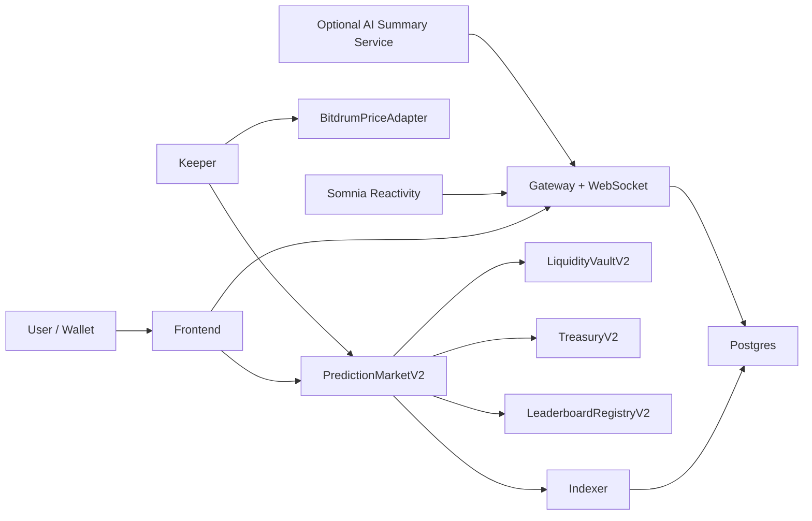

# Minimal V2 Action Plan

## Overview

This plan defines the smallest credible BitDrum v2 that can be deployed live on Somnia Shannon and demonstrated to investors with confidence. The goal is to keep the parts that materially improve the live product feel, especially Reactivity and real-time UI updates, while removing or simplifying anything that currently weakens correctness, slows delivery, or creates demo risk.

The recommended v2 shape is a vault-backed binary market with 1 minute and 5 minute durations, a keeper-managed onchain price adapter, a thin backend for indexing and live invalidation, and a frontend focused on open markets, positions, claims, and leaderboard. AI remains optional and advisory only; it does not set POM, profits, or settlement behavior.

## Goals

- Ship a live, investor-ready MVP on Somnia Shannon that users can actually interact with.
- Preserve Reactivity for low-latency feed and UI invalidation.
- Support 1 minute and 5 minute markets.
- Make settlement deterministic and defensible.
- Simplify the protocol so the vault, keeper, backend, and frontend are easy to reason about.
- Produce a migration path from the current deployed contracts to a clean v2 deployment.

## Non-Goals

- Full peer-to-peer order matching between many users.
- AI-driven payout percentages or AI-controlled market economics.
- Subscription gating for the MVP critical path.
- Streams publishing as a requirement for core product correctness.
- Mainnet launch in v2.

## Assumptions and Constraints

- Reactivity is essential and should remain in the MVP.
- 1 minute markets are mandatory for the demo.
- The current DIA-style flow is too slow for trustworthy 1 minute settlement if used directly as the only source.
- The current live stack already has deployment drift, documentation drift, and inconsistent service assumptions.
- Current repo secrets and keeper/streams keys should be treated as compromised if they were ever committed or shared.

## Requirements

### Functional

- Users can open a market in `UP` or `DOWN`.
- Users can choose `60s` or `300s`.
- Users can join existing open markets.
- Keeper auto-locks markets when join window closes.
- Keeper publishes price snapshots into an onchain adapter on a fixed cadence.
- Keeper settles markets from adapter snapshots after expiry.
- Users can claim payouts from closed markets.
- Gateway exposes market list, market detail, positions, feed, and leaderboard.
- Reactivity invalidates frontend channels on `MarketOpened`, `MarketJoined`, `MarketLocked`, `MarketSettled`, and `MarketClaimed`.

### Non-Functional

- Settlement path must not trust arbitrary user-supplied prices.
- The system must remain usable if AI is offline.
- Indexing and gateway reads must remain consistent with deployed contract events.
- Demo operators must be able to explain the system in plain English.
- Onchain and offchain components must have deterministic recovery paths after restarts.

## Current-State Audit

### What To Keep

- Somnia Shannon deployment target.
- Web frontend shell and wallet connectivity.
- Event-based indexer approach.
- Gateway WebSocket fanout pattern.
- Reactivity bridge as a notification layer.

### What To Remove or Downgrade

- AI-based POM computation.
- AI dependence in the core trade path.
- Subscription-gated signal endpoints on the critical MVP path.
- Streams as a write-on-read side effect.
- Social ranking logic that depends on large historical sample sizes before anything useful appears.

### Fund Recovery Assessment For Existing Deployments

This is the contract-level recovery position based on the current source code. It does not guarantee what balances are currently present onchain, but it does define what is and is not possible from the deployed code shape.

- `Treasury`: recoverable if the owner key still controls it. The owner can call `setRecipients(...)`, then anyone can call `distribute()` to move the balance out. If recipients are already acceptable, `distribute()` alone is enough.
- `PredictionMarket`: no admin withdrawal path exists. Native funds sitting there are not directly extractable by an owner.
- `LiquidityVault`: no withdrawal or rescue path exists. Funds can only leave through `fundMarket(...)` and `payWinner(...)`, both restricted to the market contract.
- `SubscriptionsContract`: no withdrawal path exists. `setSignalRevenuePool(...)` only affects future subscription payments, not already-held accidental balances.
- `SettlementEngine` and `LeaderboardRegistry`: not expected to hold meaningful funds.

### Practical Recovery Conclusion

- You should assume you cannot extract all funds from the old deployed contracts.
- You can likely extract treasury-held funds if you still control the treasury owner.
- You cannot rely on extracting vault or prediction market balances unless those funds are moved through the normal market lifecycle.
- V2 should be deployed fresh, and any recoverable treasury value should be migrated into the new treasury or vault.

## Target V2 Design

### Product Shape

BitDrum v2 should be presented as a fast, vault-backed directional market:

- Users choose `UP` or `DOWN`.
- Markets run for `1m` or `5m`.
- A short join window stays open after market creation.
- The vault takes the opposing exposure for unmatched or all user flow.
- Keeper locks and settles automatically.
- Winners claim native STT.

This is easier to explain than the current hybrid “every user matched by the vault but also multi-user pooled on both sides” model.

### Oracle and Settlement Model

To support 1 minute markets, v2 should introduce a small onchain `BitdrumPriceAdapter`:

- Keeper posts `BTC/USD` snapshots on a fixed cadence, preferably every `15s` or `30s`.
- The adapter stores `{price, timestamp, roundId}`.
- Market creation records the latest valid snapshot as strike.
- Settlement uses the latest valid snapshot at or after expiry, within a strict age bound.

This gives you:

- An onchain source the contracts can trust.
- 1 minute market support.
- A clean investor story: “the keeper updates the price adapter and markets settle against recorded onchain snapshots.”

For MVP, this semi-centralized oracle path is acceptable and much safer than user-supplied prices.

### Economic Simplification

Remove variable AI-controlled POM for v2. Use one of these two choices:

- Preferred: fixed payout multiplier per market duration, for example `8%` for `1m`, `15%` for `5m`.
- Alternative: fixed protocol fee plus fixed winner bonus table.

The important thing is that payout logic is static, predictable, and visible in the UI before the trade.

### Reactivity Role

Reactivity stays, but only as an event transport and invalidation layer:

- Source of truth remains contract state plus indexed events.
- Reactivity pushes “something changed” notifications.
- Gateway refetches from Postgres and rebroadcasts websocket payloads.

This keeps the live feel without making Reactivity a correctness dependency.

### AI Role

AI becomes optional and cosmetic in v2:

- It may generate a text summary or directional note.
- It does not control settlement.
- It does not control payout multipliers.
- If it fails, nothing core breaks.

## Architecture

## Implementation Plan

### Serial Dependencies (Must Complete First)

These tasks create foundations that all later work depends on.

#### Phase 0: Freeze, Inventory, and Recovery
**Prerequisite for:** All subsequent phases

| Task | Description | Output |
|------|-------------|--------|
| 0.1 | Freeze new feature work on current v1 flow. No new contract deploys until inventory is complete. | Stable baseline |
| 0.2 | Reconcile deployment docs. Build one canonical table of current Shannon addresses, owners, and expected balances. | `docs/v2_deployment_inventory.md` |
| 0.3 | Check whether treasury owner is still controlled and whether treasury holds value worth migrating. | Recovery decision |
| 0.4 | Attempt treasury extraction only if owner access is confirmed: call `setRecipients(newTreasury,newTreasury,newTreasury)` then `distribute()`. | Migrated treasury funds |
| 0.5 | Explicitly mark vault/market/subscription balances as recoverable or stranded. Do not assume they can be rescued. | Balance classification report |
| 0.6 | Rotate all keeper and publisher keys. Remove secrets from tracked env files. | New secure operator keys |
| 0.7 | Align toolchain versions: Foundry, Solc, OpenZeppelin imports, and test commands. | Working contract test baseline |

#### Phase 1: V2 Contract Spec Lock
**Prerequisite for:** Contract implementation, keeper, indexer, gateway, frontend

| Task | Description | Output |
|------|-------------|--------|
| 1.1 | Write final v2 state machine for `OPEN -> LOCKED -> CLAIMABLE -> CLOSED`. | State machine spec |
| 1.2 | Lock payout model for 1m and 5m. Prefer fixed duration-based payout rates. | Economics spec |
| 1.3 | Lock join window logic. Suggested default: `20s` join window for `1m`, `60s` for `5m`. | Timing spec |
| 1.4 | Lock oracle adapter rules: cadence, max age, strike selection, settlement snapshot selection. | Oracle adapter spec |
| 1.5 | Decide whether same-side joins are allowed. Recommended: no, unless the contract explicitly supports pooled-side accounting. | Product rule |

---

### Parallel Workstreams

These workstreams can start after Phase 1 is complete.

#### Workstream A: Contracts V2
**Dependencies:** Phase 1
**Can parallelize with:** Workstreams B, C, D

| Task | Description | Output |
|------|-------------|--------|
| A.1 | Create `BitdrumPriceAdapter.sol` with keeper-authorized snapshot posting. | New adapter contract |
| A.2 | Refactor `PredictionMarket` into `PredictionMarketV2` so open does not accept user-supplied price data. | Correct market contract |
| A.3 | Simplify vault exposure logic so accounting matches the actual product model. | Solvent payout path |
| A.4 | Add fixed payout schedule by duration instead of AI-based POM. | Deterministic economics |
| A.5 | Add explicit guardrails for 1m and 5m only. | Duration validation |
| A.6 | Add rescue logic only where it is safe and product-appropriate, especially for treasury-owned funds if desired. | Safer admin controls |
| A.7 | Add tests for oracle spoof resistance, lock timing, 1m and 5m settlement, claim lifecycle, and insolvency prevention. | Solidity test suite |
| A.8 | Add clean deploy and wiring scripts for Shannon. | Reproducible deployment |

#### Workstream B: Keeper and Oracle Operations
**Dependencies:** Phase 1
**Can parallelize with:** Workstreams A, C, D

| Task | Description | Output |
|------|-------------|--------|
| B.1 | Split keeper into two loops: `price publishing` and `market lifecycle`. | Cleaner keeper services |
| B.2 | Publish snapshots to `BitdrumPriceAdapter` every `15s` or `30s`. | Adapter updates |
| B.3 | Lock open markets as join windows expire. | Market lock automation |
| B.4 | Settle locked markets using adapter snapshots at or after expiry. | Settlement automation |
| B.5 | Add idempotency, retries, tx dedupe, and persistent checkpoints. | Reliable keeper |
| B.6 | Add structured logs for each market and each adapter round. | Operator visibility |

#### Workstream C: Indexer and Gateway Simplification
**Dependencies:** Phase 1
**Can parallelize with:** Workstreams A, B, D

| Task | Description | Output |
|------|-------------|--------|
| C.1 | Update indexer ABI and event handling for v2 contracts. | V2 event projector |
| C.2 | Normalize schema once: markets, stakes, claims, trader stats, adapter rounds if needed. | Stable schema |
| C.3 | Remove stale Starknet-era docs and assumptions from service docs. | Accurate backend docs |
| C.4 | Keep Reactivity subscriptions for market events only. | Live invalidation path |
| C.5 | Remove Streams write-on-read behavior from user-facing GET endpoints. | Read-only gateway |
| C.6 | Make AI persistence single-writer or remove persistence entirely if AI is not used in the MVP. | Cleaner data flow |
| C.7 | Reduce leaderboard logic to something that works with low history volume. | Useful early leaderboard |
| C.8 | Add health endpoints that check RPC, DB, and keeper heartbeat. | Demo operability |

#### Workstream D: Frontend MVP Surface
**Dependencies:** Phase 1
**Can parallelize with:** Workstreams A, B, C

| Task | Description | Output |
|------|-------------|--------|
| D.1 | Simplify UI copy so investors understand the product in under 30 seconds. | Clear messaging |
| D.2 | Restrict open-market choices to `1m` and `5m`. | Correct trade UI |
| D.3 | Show fixed advertised payout for each duration before trade confirmation. | Transparent economics |
| D.4 | Ensure strike and settlement explanation references the same v2 price source. | Trustworthy UX |
| D.5 | Keep feed, positions, and leaderboard powered by WebSocket + Reactivity invalidation. | Live feel |
| D.6 | Remove any UI dependence on AI for profitability numbers. | Stable UI |
| D.7 | Add operator/demo mode surfaces: current price round, market countdown, settlement status, tx links. | Investor demo controls |
| D.8 | Make default tabs investor-friendly: `Markets`, `Portfolio`, `Leaderboard`. | Clean navigation |

---

### Merge Phase

After the parallel workstreams complete, these tasks integrate the work.

#### Phase 2: Integration and Dress Rehearsal
**Dependencies:** Workstreams A, B, C, D

| Task | Description | Output |
|------|-------------|--------|
| 2.1 | Deploy v2 contracts to Shannon with fresh addresses. | Live v2 deployment |
| 2.2 | Configure keeper, indexer, gateway, and frontend against only the v2 contracts. | Clean environment |
| 2.3 | Seed vault with the exact amount needed for the demo. | Funded v2 vault |
| 2.4 | Backfill indexer from v2 deploy block only. | Clean DB state |
| 2.5 | Run a scripted smoke test: create 1m market, join, lock, settle, claim. Repeat for 5m. | End-to-end proof |
| 2.6 | Record a repeatable investor demo flow with known wallets and known stake sizes. | Demo playbook |
| 2.7 | Freeze v1 UI entry points or clearly badge them as legacy. | Operator safety |

---

## Step-by-Step Execution Sequence

1. Freeze current v1 deploy path.
2. Build and commit a single deployment inventory.
3. Recover treasury funds if possible.
4. Rotate keeper and publisher keys.
5. Finalize v2 economic model and timing model.
6. Implement `BitdrumPriceAdapter`.
7. Refactor market contract to consume adapter snapshots instead of user-supplied prices.
8. Simplify vault accounting so it matches the MVP product.
9. Remove AI-based POM and set fixed duration-based payouts.
10. Update keeper for price publishing, lock, and settle.
11. Update indexer schema and ABI for v2 events.
12. Simplify gateway and keep Reactivity-only invalidation.
13. Simplify frontend trade panel and remove AI dependence in payout UI.
14. Deploy v2 contracts.
15. Start services in order: indexer, gateway, keeper, frontend.
16. Run 1m and 5m smoke tests.
17. Prepare investor demo wallets and script.

## Testing and Validation

- Unit test adapter snapshot posting, freshness bounds, and settlement snapshot selection.
- Unit test market lifecycle for `1m` and `5m`.
- Unit test vault payout accounting and treasury fee accounting.
- Integration test keeper posting snapshots then settling markets correctly.
- Integration test indexer to Postgres to gateway to frontend refresh path.
- Manual test Reactivity invalidation for each major market event.
- Manual test wallet flow with at least two external wallets on Shannon.

## Rollout and Migration

### Migration Strategy

- Keep v1 contracts deployed but treat them as legacy.
- Recover only what is truly recoverable, beginning with treasury.
- Do not point the new frontend to mixed old and new deployments.
- Start v2 with a fresh DB namespace or a fresh database.
- Update all environment files to the v2 address set in one pass.

### Rollback Plan

- If v2 deploy fails, keep v1 untouched and revert env files.
- If keeper settlement logic fails, disable new market creation in the frontend and continue investigation.
- If Reactivity becomes unstable, gateway falls back to polling invalidation without changing contract behavior.

## Verification Checklist

- `forge build` succeeds with the chosen Solc version.
- `forge test` passes for the v2 contract suite.
- `cd backend/indexer && npm run build`
- `cd backend/gateway && npm run build`
- `cd backend/keeper && npm run build`
- `cd frontend && npm run build`
- Deploy contracts to Shannon and record addresses.
- Open a `1m` market and confirm the strike uses the adapter snapshot.
- Join the market from a second wallet.
- Confirm keeper locks it after the join window.
- Confirm keeper settles it using an adapter snapshot after expiry.
- Confirm the winner can claim.
- Repeat the same flow for `5m`.
- Confirm WebSocket clients update on open, join, lock, settle, and claim.

## Risk Assessment

| Risk | Likelihood | Impact | Mitigation |
|------|------------|--------|------------|
| Old balances in vault or market are not recoverable | High | High | Treat treasury recovery as separate from v2 launch; do not block v2 on full recovery |
| 1m oracle cadence is too slow or inconsistent | Medium | High | Use keeper-fed onchain adapter with fixed cadence and strict freshness rules |
| Keeper misses a lock or settle window | Medium | High | Add retries, checkpoints, alerts, and replay-safe execution |
| Reactivity disconnects during demo | Medium | Medium | Keep gateway polling fallback enabled |
| AI service fails and causes visible UI gaps | Medium | Medium | Make AI optional and non-critical |
| Documentation drift causes wrong env wiring | High | Medium | Maintain one canonical deployment inventory and one v2 setup doc |
| Toolchain mismatch delays contract iteration | High | Medium | Normalize Solc/OpenZeppelin/Foundry before contract work starts |

## Open Questions

- [ ] Which exact fixed payout rates should be used for `1m` and `5m`?
- [ ] Should same-side multi-user participation be supported in v2, or should each market remain effectively vault-vs-flow?
- [ ] Do you want AI to remain visible as commentary only, or should it be removed entirely from the investor demo?
- [ ] Should treasury fees accumulate for later manual distribution, or be routed immediately?
- [ ] Do you want a dedicated `Legacy Funds Recovery` admin note and checklist added after the onchain inventory is completed?

## Decision Log

| Decision | Rationale | Alternatives Considered |
|----------|-----------|------------------------|
| Keep Reactivity in v2 | It materially improves live product feel and demo quality | Remove Reactivity entirely |
| Remove AI-driven POM | AI-based economics add risk and do not help MVP credibility | Keep AI as payout controller |
| Support only `1m` and `5m` | Fast enough for demo traders, simple enough to operate | Keep `30s`, `1m`, and `5m` |
| Add onchain price adapter | Enables trustworthy 1m and 5m settlement | Keep direct user-supplied or stale oracle inputs |
| Deploy fresh v2 contracts | Current v1 has structural issues and partial fund lock risk | Patch v1 in place |
| Treat treasury recovery separately from v2 launch | Full old-fund recovery is not guaranteed | Block v2 until all funds are extracted |

